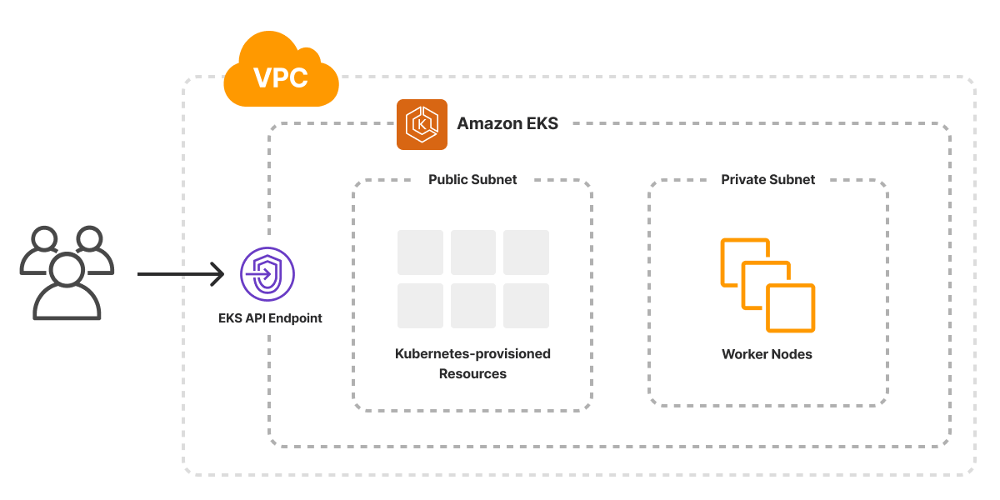

# Terraform EKS and VPC Setup

## Overview

This Terraform codebase provisions an Amazon Web Services (AWS) Elastic Kubernetes Service (EKS) cluster along with a custom Virtual Private Cloud (VPC) network. The setup includes the creation of a VPC, public and private subnets, an internet gateway, a NAT gateway, and an EKS cluster with managed node groups. The infrastructure is designed to be production-ready with scalability and high availability in mind.

### Key Components
1. **VPC (Virtual Private Cloud):** A custom VPC with both public and private subnets.
2. **Subnets:** Public subnets for external traffic and private subnets for internal resources.
3. **Internet Gateway:** Facilitates internet access for resources within the public subnet.
4. **NAT Gateway:** Allows instances in private subnets to access the internet securely.
5. **Route Tables:** Routes traffic within the VPC and to the internet.
6. **Elastic Kubernetes Service (EKS):** Fully managed Kubernetes service with managed node groups.

## Prerequisites

### Tools
- [Terraform](https://www.terraform.io/downloads.html) - Version `>= 1.0`
- AWS CLI configured with appropriate credentials
- [kubectl](https://kubernetes.io/docs/tasks/tools/install-kubectl/) - Version `>= 1.14.0`
- [helm](https://helm.sh/docs/intro/install/) - Version `>= 2.6.0`

### AWS Setup
Ensure that your AWS account has sufficient permissions to create resources, including but not limited to:
- VPC
- Subnets
- Internet Gateways
- NAT Gateways
- EKS Clusters
- IAM Roles
- EC2 Instances

### Variables
The configuration uses various input variables, making it flexible to adapt to different environments. Key variables include:
- `vpc_cidr_block`: CIDR block for the VPC.
- `availability_zones`: Availability Zones for subnets.
- `cluster_name`: The name of the EKS cluster.
- `instance_type`: EC2 instance types for the EKS node group.
- `max_size`, `min_size`, `desired_size`: Configurations for autoscaling the EKS node group.

## Directory Structure

```plaintext
├── main.tf              # Main Terraform configuration file.
├── modules
│   └── vpc              # Custom module to create VPC and associated resources.
│       ├── main.tf      # Terraform configuration for VPC.
│       ├── outputs.tf   # Outputs from VPC module.
│       └── variables.tf # Input variables for VPC module.
├── outputs.tf           # Outputs from the root module.
├── providers.tf         # Configuration for providers (AWS, Helm, Kubectl).
└── variables.tf         # Input variables for the root module.
```

### Description of Files

- **modules/vpc/main.tf:** Contains the Terraform code for creating the VPC, Subnets, Internet Gateway, NAT Gateway, Route Tables, and Route Table Associations.
- **modules/vpc/outputs.tf:** Defines the output values for the VPC module, including VPC ID, public subnet IDs, and private subnet IDs.
- **modules/vpc/variables.tf:** Contains variable definitions used within the VPC module.
- **main.tf:** The main entry point for the Terraform code. It calls the VPC and EKS modules to create the infrastructure.
- **providers.tf:** Specifies the AWS provider and required providers (e.g., kubectl, helm).
- **variables.tf:** Defines global variables used throughout the Terraform code.

## VPC Module

### VPC Creation

The VPC is created with a CIDR block of `10.0.0.0/16`. DNS hostnames and DNS support are enabled to allow instances within the VPC to resolve public DNS names.

```hcl
resource "aws_vpc" "vpc" {
    cidr_block = "10.0.0.0/16"
    enable_dns_hostnames = true
    enable_dns_support = true
    tags = {
        Name = var.vpc_name
        env  = "Prod"
        vpc  = var.vpc_name
    }
}
```
# Terraform VPC and EKS Setup

### Variables to Customize

1. **Project Name**:
   - **Variable**: `project-name`
   - **Default**: `eks`
   - **Description**: Prefix for all services that will be created.

2. **VPC CIDR Block**:
   - **Variable**: `vpc_cidr_block`
   - **Default**: `10.0.0.0/16`
   - **Description**: The CIDR block for the VPC.

3. **Private Subnet CIDR Blocks**:
   - **Variable**: `private_subnet_cidr_blocks`
   - **Default**: `["10.0.3.0/24", "10.0.4.0/24"]`
   - **Description**: CIDR blocks for private subnets.

4. **Public Subnet CIDR Blocks**:
   - **Variable**: `public_subnet_cidr_blocks`
   - **Default**: `["10.0.1.0/24", "10.0.2.0/24"]`
   - **Description**: CIDR blocks for public subnets.

5. **Availability Zones**:
   - **Variable**: `availability_zones`
   - **Default**: `["us-east-1a", "us-east-1b"]`
   - **Description**: Availability zones where the subnets will be created.

6. **EKS Cluster Name**:
   - **Variable**: `cluster_name`
   - **Default**: `my-eks`
   - **Description**: Name of the EKS cluster.

7. **EKS Cluster Version**:
   - **Variable**: `cluster_version`
   - **Default**: `1.30`
   - **Description**: Kubernetes version for the EKS cluster.

8. **Instance Type**:
   - **Variable**: `instance_type`
   - **Default**: `["t3.medium"]`
   - **Description**: EC2 instance types for the EKS node group.

9. **Node Group Min Size**:
   - **Variable**: `min_size`
   - **Default**: `1`
   - **Description**: Minimum number of nodes in the node group.

10. **Node Group Max Size**:
    - **Variable**: `max_size`
    - **Default**: `1`
    - **Description**: Maximum number of nodes in the node group.

11. **Node Group Desired Size**:
    - **Variable**: `desired_size`
    - **Default**: `1`
    - **Description**: Desired number of nodes in the node group.

12. **Node Group Disk Size**:
    - **Variable**: `disk_size`
    - **Default**: `40`
    - **Description**: Disk size in GB for the EKS node group instances.

### Steps to Run Terraform Code

1. **Initialize Terraform**:
   - Run the following command to initialize the Terraform working directory:
     ```bash
     terraform init
     ```

2. **Validate Configuration**:
   - To validate the Terraform configuration files, run:
     ```bash
     terraform validate
     ```

3. **Plan Infrastructure**:
   - To see the execution plan and preview changes without applying them, run:
     ```bash
     terraform plan
     ```

4. **Apply Changes**:
   - To apply the changes and create the infrastructure, run:
     ```bash
     terraform apply
     ```

5. **Destroy Infrastructure (Optional)**:
   - If you need to destroy the infrastructure, run:
     ```bash
     terraform destroy
     ```

### Notes

- Make sure your AWS credentials are configured properly, as Terraform will use them to provision resources in your AWS account.
- Customize the variables as needed before running the Terraform commands to ensure that the infrastructure meets your specific requirements.
- This Terraform code sets up a VPC with public and private subnets and provisions an EKS cluster with the specified configurations.
